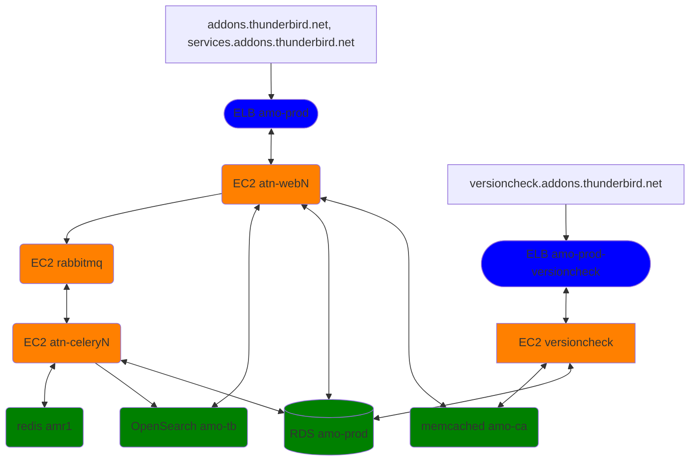

# Documentation for addons.thunderbird.net

## Overview

There are two primary sites that comprise ATN:
1. The main website at addons.thunderbird.net and the various client domains that connect to the same site.
2. `versioncheck`, the separate stack that runs the API that Thunderbird checks for add-on updates.

All types of EC2 nodes can be deployed by running the `deploy-instance.yml` playbook.
Different node types use different environment variable files, like `prod-web.yml`, `prod-celery.yml`, etc.

Long-lived managed AWS resources like RDS, ELBs, etc are not managed with these scripts.

## Deployment

Playbooks use the ansible ec2 module, which tracks the number of instances running by a tag. When you run a script, it will attempt to ensure that the correct number of instances is created(including shutting some down if there's too many!!!) and then will set them up, restart docker, etc.

Docker containers are automatically pulled down from docker hub during the deployment process.

For example, to redeploy the test instance:
1. `source ~/thundernest-ansible/files/secrets.sh ; cd ~/thundernest-ansible/addons/playbooks`
2. `ansible-playbook --extra-vars "@../env/test-web.yml" deploy-instance.yml`

To deploy or restart the production web servers:

`ansible-playbook --extra-vars "@../env/prod-web.yml" deploy-instance.yml`

Below is a diagram of

